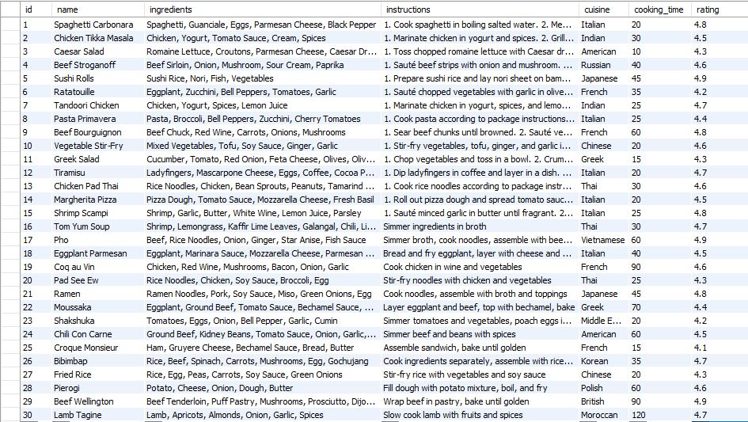

# MyRecipes :plate_with_cutlery:	
## Description
This project is a recipe management application developed in Java. It allows users to add, find, and delete recipes from a MySQL database using command-line interface (CLI) interaction.

## Requirements
* Java Runtime Environment (JRE) version 8 or higher
* MySQL Server
* MySQL Workbench (Optional)

## Usage Examples
### Adding a Recipe
To add a new recipe to the database, follow these steps:
1. Run the application.
2. Choose the "Add recipe" option from the menu.
3. Enter the details of the recipe when prompted, including the name, ingredients, instructions, cuisine, cooking time, and rating.
4. The recipe will be added to the database.

### Finding Recipes
To search for recipes based on specific criteria, follow these steps:
1. Run the application.
2. Choose the "Find recipes" option from the menu.
3. Enter the desired filters, such as cuisine, maximum cooking time, and minimum rating.
4. The application will display a list of recipes that match the specified criteria.

### Showing All Recipes
To view a list of all recipes in the database, follow these steps:
1. Run the application.
2. Choose the "Show all recipes" option from the menu.
3. The application will display a list of all recipes stored in the database.

### Deleting a Recipe
To remove a recipe from the database, follow these steps:
1. Run the application.
2. Choose the "Delete recipe" option from the menu.
3. Enter the ID of the recipe you want to delete when prompted.
4. The application will delete the recipe from the database if it exists.

## MySQL DataBase 

